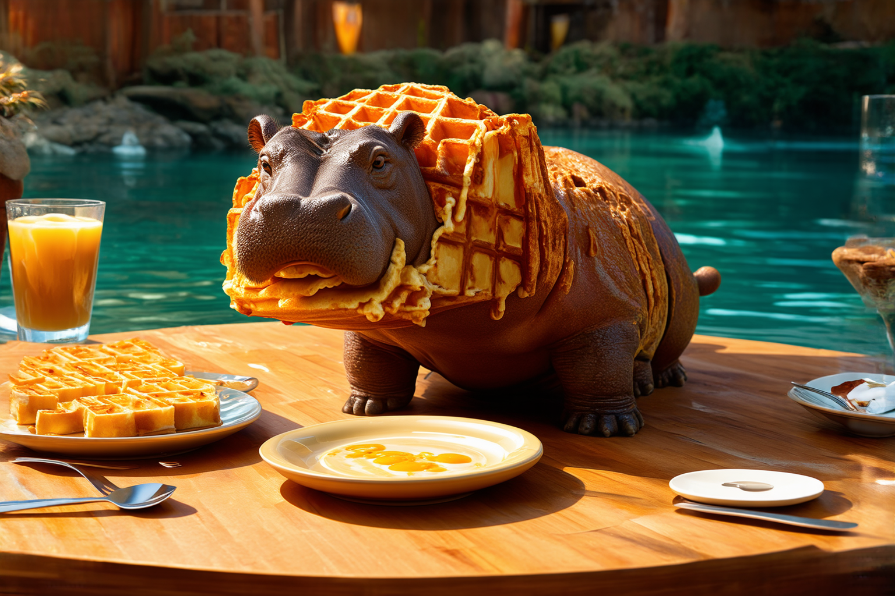
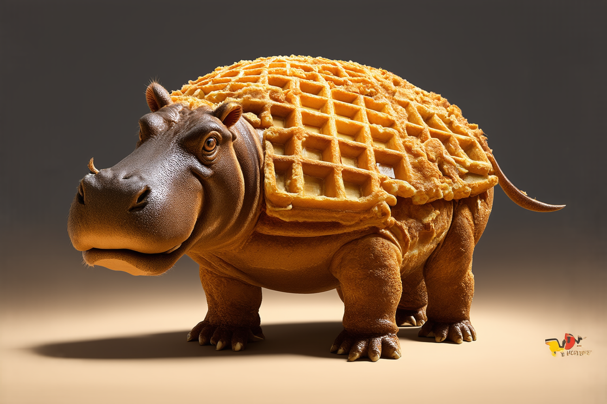
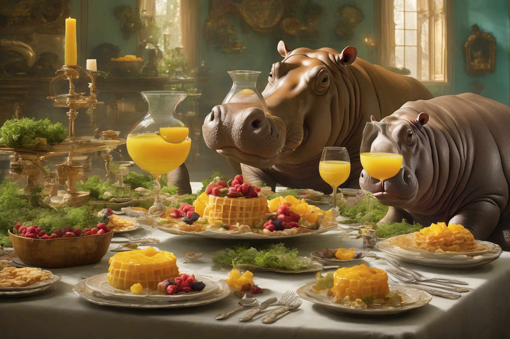
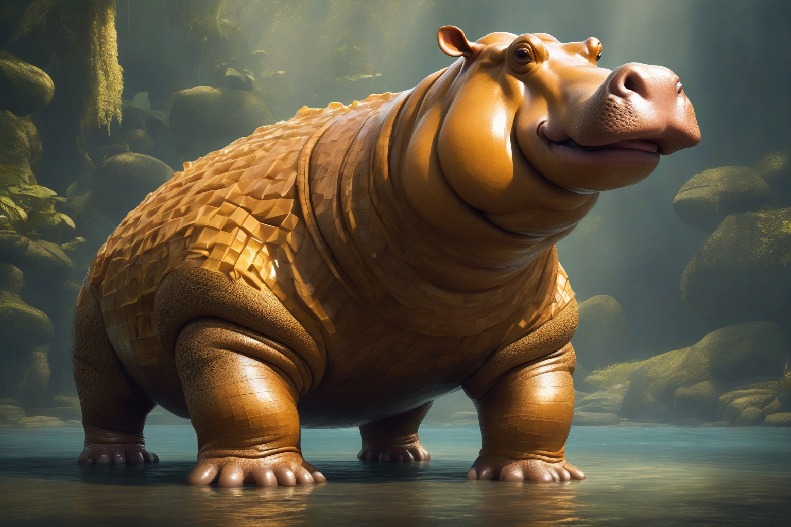
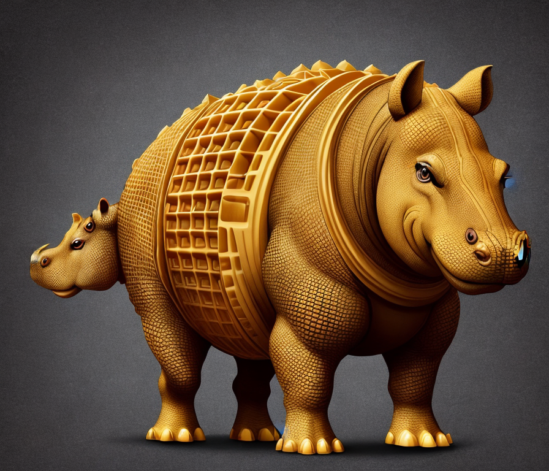

# Stable Diffusion Long Prompt Weighted Embedding

- [Stable Diffusion Long Prompt Weighted Embedding](#stable-diffusion-long-prompt-weighted-embedding)
  - [Updates](#updates)
  - [Install](#install)
  - [Flux.1](#flux1)
  - [Stable Diffusion 3](#stable-diffusion-3)
    - [Results](#results)
  - [Stable Cascade](#stable-cascade)
    - [Results](#results-1)
  - [Stable Diffusion XL](#stable-diffusion-xl)
    - [Results](#results-2)
  - [Stable Diffusion V1.5](#stable-diffusion-v15)
    - [Results](#results-3)
  - [Citation](#citation)

<a href="https://www.amazon.com/Using-Stable-Diffusion-Python-Generation/dp/1835086373" target="_blank"></a>

Overcoming the 77-token prompt limitation, generating long-weighted prompt embeddings for Stable Diffusion, this module supports generating embedding and pooled embeddings for long prompt weighted. The generated embedding is compatible with [Huggingface Diffusers](https://github.com/huggingface/diffusers). 

The prompt format is compatible with [AUTOMATIC1111 stable-diffusion-webui](https://github.com/AUTOMATIC1111/stable-diffusion-webui)

* Support unlimited prompt length for SD1.5 and SDXL
* Support weighting like `a (white:1.2) cat`
* Support parentheses like `a ((white)) cat`
* For SD3, support max 512 tokens (T5 model support max 512 tokens)

Support Stable Diffusion v1.5, SDXL and **Stable Diffusion 3**.

The detailed implementation is covered in chapter 10 of book [Using Stable Diffusion with Python](https://www.amazon.com/Using-Stable-Diffusion-Python-Generation/dp/1835086373/ref=sr_1_1?crid=2EF28F3KPIZMI&dib=eyJ2IjoiMSJ9.quUjZV6jP2UJs4Uv72YiPA.IPU_TA7myv0fiuvYuspHdYbCcFWhg7USvj1p9KI_4RM&dib_tag=se&keywords=Using+Stable+Diffusion+with+Python&qid=1717696681&sprefix=using+stable+diffusion+with+python%2Caps%2C184&sr=8-1)

## Updates

* [09/10/2024] Add Stable Cascade long prompt support, check out `samples/lpw_stablecascade.py` file to see the usage sample.

* [08/29/2024] Add a tool to convert Civitai.com FLUX model to Diffusers format. see sample code in `samples/convert_civitai_safetensor_to_diffusers.py`

* [08/28/2024] Support `pipe.enable_model_cpu_offload()`, update sample code to use `torchao`, reduce VRAM usage.

* [08/06/2024] Add FLUX.1 long prompt support, check out `samples/lpw_flux1.py` file to see the usage sample.

* [06/30/2024] Add support Stable Diffusion 3 pipeline without T5 encoder.

## Install 

install `torchao`:
```
pip install torchao --extra-index-url https://download.pytorch.org/whl/cu121 # full options are cpu/cu118/cu121/cu124
```
See more detail at [torchao](https://github.com/pytorch/ao)

Install `sd_embed`:
```sh
pip install git+https://github.com/xhinker/sd_embed.git@main
```


## Flux.1

<details>

<summary>Flux.1 embedding usage</summary>

To use Flux.1 in a 24G VRAM GPU, we need to quantize the Transformer model and T5 text encoder model to `qfloat8` using `optimum-quanto`. see [Quanto: a PyTorch quantization backend for Optimum](https://huggingface.co/blog/quanto-introduction) and [Memory-efficient Diffusion Transformers with Quanto and Diffusers](https://huggingface.co/blog/quanto-diffusers) to convert Diffusion model weights to `qfloat8` so that we can use Flux in a 24G VRAM with Diffusers. 

Here is the complete usage sample: 

```py
from diffusers import DiffusionPipeline, FluxTransformer2DModel
from torchao.quantization import quantize_, int8_weight_only
import torch
from sd_embed.embedding_funcs import get_weighted_text_embeddings_flux1

# model_path = "black-forest-labs/FLUX.1-schnell"
model_path = "/home/andrewzhu/storage_14t_5/ai_models_all/sd_hf_models/black-forest-labs/FLUX.1-dev_main"

transformer = FluxTransformer2DModel.from_pretrained(
    model_path
    , subfolder = "transformer"
    , torch_dtype = torch.bfloat16
)
quantize_(transformer, int8_weight_only())

pipe = DiffusionPipeline.from_pretrained(
    model_path
    , transformer = transformer
    , torch_dtype = torch.bfloat16
)

pipe.enable_model_cpu_offload()

#%%
prompt = """\
A dreamy, soft-focus photograph capturing a romantic Jane Austen movie scene, 
in the style of Agnes Cecile. Delicate watercolors, misty background, 
Regency-era couple, tender embrace, period clothing, flowing dress, dappled sunlight, 
ethereal glow, gentle expressions, intricate lace, muted pastels, serene countryside, 
timeless romance, poetic atmosphere, wistful mood, look at camera.
"""

prompt_embeds, pooled_prompt_embeds = get_weighted_text_embeddings_flux1(
    pipe        = pipe
    , prompt    = prompt
)
image = pipe(
    prompt_embeds               = prompt_embeds
    , pooled_prompt_embeds      = pooled_prompt_embeds
    , width                     = 896
    , height                    = 1280
    , num_inference_steps       = 20
    , guidance_scale            = 4.0
    , generator                 = torch.Generator().manual_seed(1234)
).images[0]
display(image)
```

If you use `FLUX.1-schnell`, set `num_inference_steps` to `4`. 


</details>

## Stable Diffusion 3

<details>

<summary>Generate long prompt weighted embeddings for Stable Diffusion 3 </summary>

Load up SD3 model:
```py
import gc
import torch
from diffusers import StableDiffusion3Pipeline
from sd_embed.embedding_funcs import get_weighted_text_embeddings_sd3

model_path = "stabilityai/stable-diffusion-3-medium-diffusers"
pipe = StableDiffusion3Pipeline.from_pretrained(
    model_path,
    torch_dtype=torch.float16
)
```

Generate the embedding and use it to generate images:
```py
pipe.to('cuda')

prompt = """A whimsical and creative image depicting a hybrid creature that is a mix of a waffle and a hippopotamus. 
This imaginative creature features the distinctive, bulky body of a hippo, 
but with a texture and appearance resembling a golden-brown, crispy waffle. 
The creature might have elements like waffle squares across its skin and a syrup-like sheen. 
It's set in a surreal environment that playfully combines a natural water habitat of a hippo with elements of a breakfast table setting, 
possibly including oversized utensils or plates in the background. 
The image should evoke a sense of playful absurdity and culinary fantasy.
"""

neg_prompt = """\
skin spots,acnes,skin blemishes,age spot,(ugly:1.2),(duplicate:1.2),(morbid:1.21),(mutilated:1.2),\
(tranny:1.2),mutated hands,(poorly drawn hands:1.5),blurry,(bad anatomy:1.2),(bad proportions:1.3),\
extra limbs,(disfigured:1.2),(missing arms:1.2),(extra legs:1.2),(fused fingers:1.5),\
(too many fingers:1.5),(unclear eyes:1.2),lowers,bad hands,missing fingers,extra digit,\
bad hands,missing fingers,(extra arms and legs),(worst quality:2),(low quality:2),\
(normal quality:2),lowres,((monochrome)),((grayscale))
"""

(
    prompt_embeds
    , prompt_neg_embeds
    , pooled_prompt_embeds
    , negative_pooled_prompt_embeds
) = get_weighted_text_embeddings_sd3(
    pipe
    , prompt = prompt
    , neg_prompt = neg_prompt
)

image = pipe(
    prompt_embeds                   = prompt_embeds
    , negative_prompt_embeds        = prompt_neg_embeds
    , pooled_prompt_embeds          = pooled_prompt_embeds
    , negative_pooled_prompt_embeds = negative_pooled_prompt_embeds
    , num_inference_steps           = 30
    , height                        = 1024 
    , width                         = 1024 + 512
    , guidance_scale                = 4.0
    , generator                     = torch.Generator("cuda").manual_seed(2)
).images[0]
display(image)

del prompt_embeds, prompt_neg_embeds,pooled_prompt_embeds, negative_pooled_prompt_embeds
pipe.to('cpu')
gc.collect()
torch.cuda.empty_cache()
```

### Results

Using long weighted embedding result:


Without long prompt weighted embedding result:


</details>

## Stable Cascade

<details>

<summary>Stable Cascade embedding usage sample</summary>

To use the long prompt weighted embedding for Stable Cascade, simply import the embedding function - `from sd_embed.embedding_funcs import get_weighted_text_embeddings_s_cascade` for stable cascade.

```py
import gc
import torch
from sd_embed.embedding_funcs import get_weighted_text_embeddings_s_cascade
from diffusers import StableCascadePriorPipeline, StableCascadeDecoderPipeline

prior = StableCascadePriorPipeline.from_pretrained(
    "stabilityai/stable-cascade-prior",
    variant='bf16',
    torch_dtype=torch.bfloat16)

decoder = StableCascadeDecoderPipeline.from_pretrained(
    "stabilityai/stable-cascade",
    variant='bf16',
    torch_dtype=torch.float16)

prompt = """A whimsical and creative image depicting a hybrid creature that is a mix of a waffle and a hippopotamus. 
This imaginative creature features the distinctive, bulky body of a hippo, 
but with a texture and appearance resembling a golden-brown, crispy waffle. 
The creature might have elements like waffle squares across its skin and a syrup-like sheen. 
It's set in a surreal environment that playfully combines a natural water habitat of a hippo with elements of a breakfast table setting, 
possibly including oversized utensils or plates in the background. 
The image should evoke a sense of playful absurdity and culinary fantasy.
"""

neg_prompt = """\
skin spots,acnes,skin blemishes,age spot,(ugly:1.2),(duplicate:1.2),(morbid:1.21),(mutilated:1.2),\
(tranny:1.2),mutated hands,(poorly drawn hands:1.5),blurry,(bad anatomy:1.2),(bad proportions:1.3),\
extra limbs,(disfigured:1.2),(missing arms:1.2),(extra legs:1.2),(fused fingers:1.5),\
(too many fingers:1.5),(unclear eyes:1.2),lowers,bad hands,missing fingers,extra digit,\
bad hands,missing fingers,(extra arms and legs),(worst quality:2),(low quality:2),\
(normal quality:2),lowres,((monochrome)),((grayscale))
"""

generator = torch.Generator(device='cuda').manual_seed(3)

# prior
prior.to('cuda')

(
    prompt_embeds
    , negative_prompt_embeds
    , pooled_prompt_embeds
    , negative_prompt_embeds_pooled
) = get_weighted_text_embeddings_s_cascade(prior, prompt, neg_prompt)

prior_output = prior(
    prompt_embeds                   = prompt_embeds
    , negative_prompt_embeds        = negative_prompt_embeds
    , prompt_embeds_pooled          = pooled_prompt_embeds
    , negative_prompt_embeds_pooled = negative_prompt_embeds_pooled
    , num_inference_steps           = 30
    , guidance_scale                = 8
    , height                        = 1024
    , width                         = 1024 + 512
    , generator                     = generator
)

del prompt_embeds, pooled_prompt_embeds, negative_prompt_embeds, negative_prompt_embeds_pooled
prior.to('cpu')

# decoder
decoder.to('cuda')

(
    prompt_embeds
    , negative_prompt_embeds
    , pooled_prompt_embeds
    , negative_prompt_embeds_pooled
) = get_weighted_text_embeddings_s_cascade(decoder, prompt, neg_prompt)

image = decoder(
    prompt_embeds                   = prompt_embeds
    , negative_prompt_embeds        = negative_prompt_embeds
    , prompt_embeds_pooled          = pooled_prompt_embeds
    , negative_prompt_embeds_pooled = negative_prompt_embeds_pooled
    , image_embeddings              = prior_output.image_embeddings.half()
    , num_inference_steps           = 10
    , guidance_scale                = 0
    , generator                     = generator
).images[0]

display(image)

del prompt_embeds, pooled_prompt_embeds, negative_prompt_embeds, negative_prompt_embeds_pooled
decoder.to('cpu')
gc.collect()
torch.cuda.empty_cache()
```


### Results

Using long prompt weighted embedding:


Without using long prompt weighted embedding:


</details>

## Stable Diffusion XL 

<details>

<summary>SDXL embedding usage sample</summary>

To use the long prompt weighted embedding for SDXL, simply import the embedding function - `from sd_embed.embedding_funcs import get_weighted_text_embeddings_sdxl` for sdxl. 

```py
import gc
import torch
from diffusers import StableDiffusionXLPipeline
from sd_embed.embedding_funcs import get_weighted_text_embeddings_sdxl

model_path = "Lykon/dreamshaper-xl-1-0"
pipe = StableDiffusionXLPipeline.from_pretrained(
    model_path,
    torch_dtype=torch.float16
)
pipe.to('cuda')

prompt = """A whimsical and creative image depicting a hybrid creature that is a mix of a waffle and a hippopotamus. 
This imaginative creature features the distinctive, bulky body of a hippo, 
but with a texture and appearance resembling a golden-brown, crispy waffle. 
The creature might have elements like waffle squares across its skin and a syrup-like sheen. 
It's set in a surreal environment that playfully combines a natural water habitat of a hippo with elements of a breakfast table setting, 
possibly including oversized utensils or plates in the background. 
The image should evoke a sense of playful absurdity and culinary fantasy.
"""

neg_prompt = """\
skin spots,acnes,skin blemishes,age spot,(ugly:1.2),(duplicate:1.2),(morbid:1.21),(mutilated:1.2),\
(tranny:1.2),mutated hands,(poorly drawn hands:1.5),blurry,(bad anatomy:1.2),(bad proportions:1.3),\
extra limbs,(disfigured:1.2),(missing arms:1.2),(extra legs:1.2),(fused fingers:1.5),\
(too many fingers:1.5),(unclear eyes:1.2),lowers,bad hands,missing fingers,extra digit,\
bad hands,missing fingers,(extra arms and legs),(worst quality:2),(low quality:2),\
(normal quality:2),lowres,((monochrome)),((grayscale))
"""

(
    prompt_embeds
    , prompt_neg_embeds
    , pooled_prompt_embeds
    , negative_pooled_prompt_embeds
) = get_weighted_text_embeddings_sdxl(
    pipe
    , prompt = prompt
    , neg_prompt = neg_prompt
)

image = pipe(
    prompt_embeds                   = prompt_embeds
    , negative_prompt_embeds        = prompt_neg_embeds
    , pooled_prompt_embeds          = pooled_prompt_embeds
    , negative_pooled_prompt_embeds = negative_pooled_prompt_embeds
    , num_inference_steps           = 30
    , height                        = 1024 
    , width                         = 1024 + 512
    , guidance_scale                = 4.0
    , generator                     = torch.Generator("cuda").manual_seed(2)
).images[0]
display(image)

del prompt_embeds, prompt_neg_embeds,pooled_prompt_embeds, negative_pooled_prompt_embeds
pipe.to('cpu')
gc.collect()
torch.cuda.empty_cache()
```

### Results

Using long prompt weighted embedding:


Without using long prompt weighted embedding:


</details>

## Stable Diffusion V1.5

<details>

<summary>Stable Diffusion V1.5 usage sample</summary>

To use the long prompt weighted embedding for SDXL, use the embedding function - `get_weighted_text_embeddings_sd15`. 

```py
import gc
import torch
from diffusers import StableDiffusionPipeline
from sd_embed.embedding_funcs import get_weighted_text_embeddings_sd15

model_path = "stablediffusionapi/deliberate-v2"
pipe = StableDiffusionPipeline.from_pretrained(
    model_path,
    torch_dtype=torch.float16
)

pipe.to('cuda')

prompt = """A whimsical and creative image depicting a hybrid creature that is a mix of a waffle and a hippopotamus. 
This imaginative creature features the distinctive, bulky body of a hippo, 
but with a texture and appearance resembling a golden-brown, crispy waffle. 
The creature might have elements like waffle squares across its skin and a syrup-like sheen. 
It's set in a surreal environment that playfully combines a natural water habitat of a hippo with elements of a breakfast table setting, 
possibly including oversized utensils or plates in the background. 
The image should evoke a sense of playful absurdity and culinary fantasy.
"""

neg_prompt = """\
skin spots,acnes,skin blemishes,age spot,(ugly:1.2),(duplicate:1.2),(morbid:1.21),(mutilated:1.2),\
(tranny:1.2),mutated hands,(poorly drawn hands:1.5),blurry,(bad anatomy:1.2),(bad proportions:1.3),\
extra limbs,(disfigured:1.2),(missing arms:1.2),(extra legs:1.2),(fused fingers:1.5),\
(too many fingers:1.5),(unclear eyes:1.2),lowers,bad hands,missing fingers,extra digit,\
bad hands,missing fingers,(extra arms and legs),(worst quality:2),(low quality:2),\
(normal quality:2),lowres,((monochrome)),((grayscale))
"""

(
    prompt_embeds
    , prompt_neg_embeds
) = get_weighted_text_embeddings_sd15(
    pipe
    , prompt = prompt
    , neg_prompt = neg_prompt
)

image = pipe(
    prompt_embeds                   = prompt_embeds
    , negative_prompt_embeds        = prompt_neg_embeds
    , num_inference_steps           = 30
    , height                        = 768
    , width                         = 896
    , guidance_scale                = 8.0
    , generator                     = torch.Generator("cuda").manual_seed(2)
).images[0]
display(image)

del prompt_embeds, prompt_neg_embeds
pipe.to('cpu')
gc.collect()
torch.cuda.empty_cache()
```

### Results

Using long prompt weighted embedding:


Without using long prompt weighted embedding:


</details>

## Citation

If you use `sd_embed` in your research, please cite the following work:

```
@misc{sd_embed_2024,
  author       = {Shudong Zhu(Andrew Zhu)},
  title        = {Long Prompt Weighted Stable Diffusion Embedding},
  howpublished = {\url{https://github.com/xhinker/sd_embed}},
  year         = {2024},
}
```